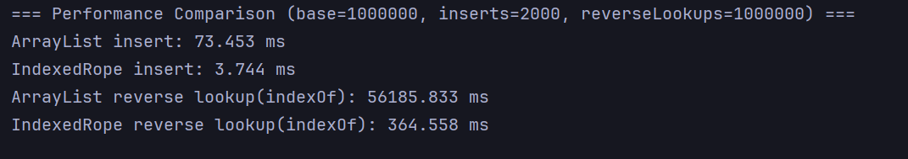

 # Knot - A Rope Data Structure Library Implemented in Kotlin

## Why Use Rope?

**Rope** is a linear data structure designed to optimize the complexity of all core operations (insertion, query, and deletion) to . In most scenarios, you might not actually need a Rope, as `String` and `List` are perfectly capable of meeting your requirements.

The most classic use case for a Rope is in **large-scale document editing**. For a `String` (which is essentially a `Char` array), when you press Enter on the -th line of a document with  lines, the following happens under the hood: the content from lines  is shifted to lines , and then line  is set as an empty line. Obviously, this is an  operation. When a document exceeds 1MB, performance degradation becomes noticeable. The same limitation applies to a `List`.

Another scenario for Rope is **reverse index lookup**. When you need to quickly find the index of an element within a linear data structure, it typically requires  time complexity. Even if we cache the index information within the element fields, we still need to update the fields of all elements from  onwards whenever the -th element is inserted or deleted.

## Roadmap

The initial implementation of this project originated from my work on an LSP (Language Server Protocol) backend for a custom DSL, where document sizes reached up to  lines. Handling scenarios like **incremental compilation** and **code indexing** necessitated a **bi-directional mapping between the AST and line numbers**. After researching existing solutions, I implemented the first version of Rope based on an AVL tree, which was highly specialized for that specific DSL.

I am currently refactoring the codebase to make it more robust and versatile. Key goals include:

* **Optimizing the Balanced Tree Implementation:**
* Designing standardized interfaces for balanced trees to allow for pluggable underlying algorithmic implementations.
* Replacing the AVL tree with a **Treap (Split/Merge version)**. While not necessarily the absolute fastest in all cases, it offers the most concise codebase and the highest maintainability in the short term.

* **Generalizing the API:** Evolving the design from a domain-specific tool into a general-purpose data structure library.
* **CharRope Implementation:** Providing a high-performance `CharRope` implementation specifically optimized for `String`-like use cases.
* **Quality Assurance:** Developing comprehensive unit tests and performance benchmarks to ensure the library is both robust and high-performing.

## Performance

